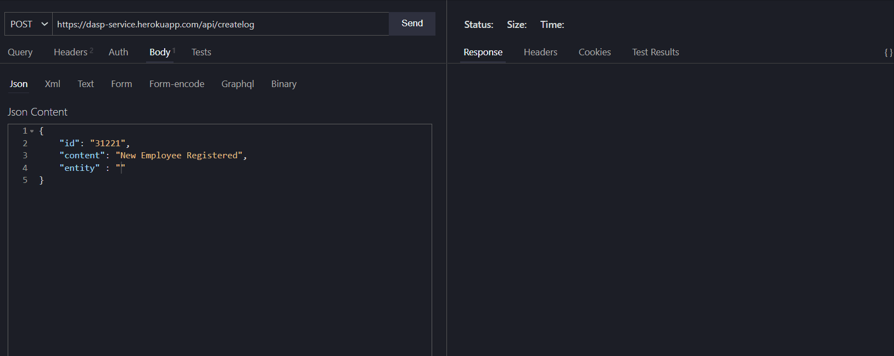
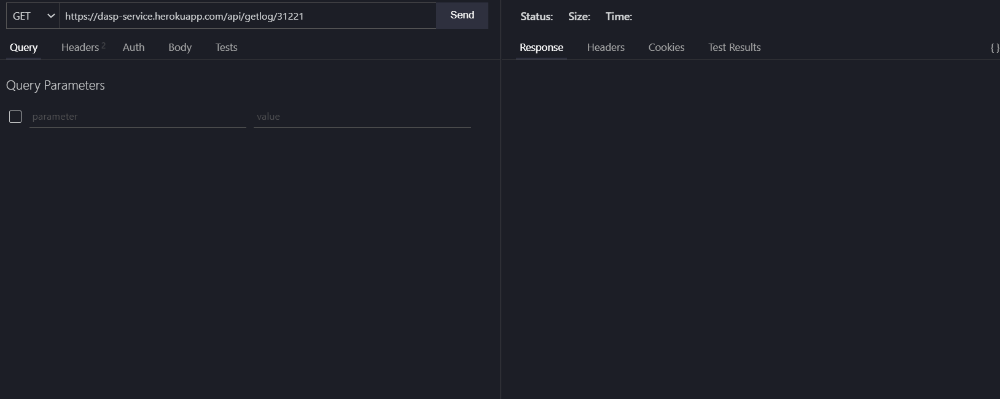
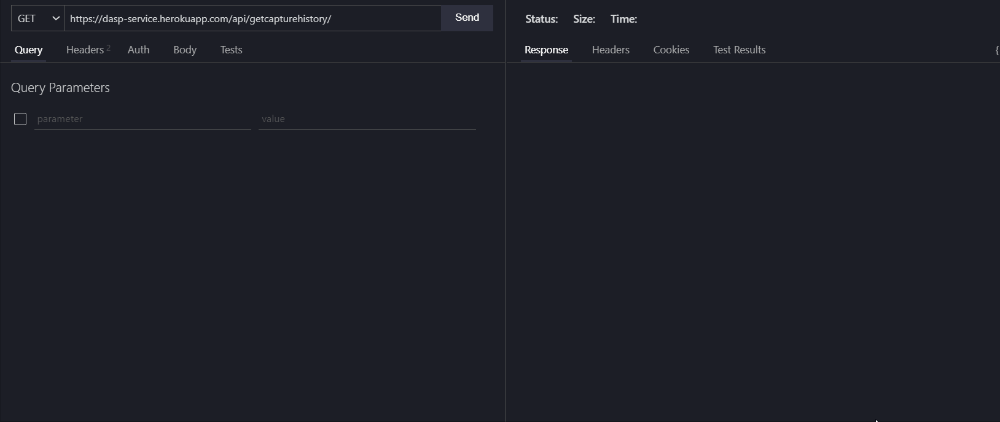
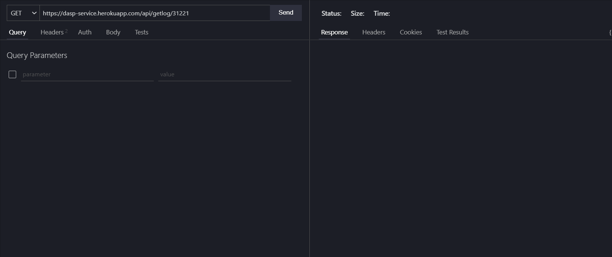

<center>


</center>

# Data Audit and SnapShot Plugin

[](https://github.com/H2H-DASP/DataAudit-SnapShotPlugin "Repo Maintained")
[](https://GitHub.com/akashchouhan16/ "github.com/akashchouhan16")
[](https://code.visualstudio.com/ "VSCODE")
[](https://github.com/H2H-DASP/DataAudit-SnapShotPlugin/issues)  


The **Data Audit and Snapshot Plugin** (DASP) is a **Node.js** application that provides an easy to use, web-based utility to study the genealogy of data as it gets created, stored, modified, deleted and analysed on a recurring basis.

## 💭 About The Service
DASP plugin exposes simple HTTP endpoints to register client's data items and captures changes on data item over time. The client can register the data item and view all changes on it. The clients have the option to either view all the changes made to their data or be able to view the audit history for the same, based on the time stamp.
* It also includes the ability to add a filter to view the capture history based on categories. 
* The plugin also supports toggle functionality to enable/disable CDC on specific items based on the **data category** (`user defined entity classification`) or based on the **unique ID** for a specific data item.

### Project Stack
* Node.js
* EJS
* Express.js
* MongoDB Atlas
  
--- 
## Developer Environment Set-up
* Make sure, the following are installed in the local system.
  * `Node` and `npm`
  * `mongodb`
  * `git`
* Steps to set up the service on development enviroment
  * Clone this repository `git clone https://github.com/H2H-DASP/DataAudit-SnapShotPlugin.git`
  *  Install dependencies 
     ```
        npm i --save
     ```
  *  Run the development server
     ```
        npm run dev
     ```
  * Visit `http://localhost:5000`

---

## DASP Service Endpoints

* To Plug the DASP utility to client's data item:
  * Make a `POST` request to register it onto our service. 
    ```
    /api/createlog
    ```
  * Once client's data item is registered, it can be identified by a **data_id** which is unique for every data item registered on DASP.
  * 

---

* To check current state of your data item with last modified time stamp: 
   * Make a `GET` request to our service with the **data_id**.
        ```
        /api/getlog/:data_id
        ```
   
   * 
---
* To fetch all registerd data items with the current state along with last updated time stamp. (For development purpose only)
  * Make a `GET` request to our service
    ```
    /api/getlog
    ```
---
* To fetch the **audit history** for your data, captured by the service
  * Make a `GET` request to our service with the **data_id**. 
    ```
    /api/getcapturehistory/:data_id
    ```
  * The endpoint will provide all the different versions of your data.
  
  * 
---
* To toggle Data Capturing of your data item
  * Make a `PUT` request to the service with your **data_id**. 
    ```
    /api/togglelog/:data_id
    ```
  * 
  * The toggle feature allows the client to **enable/disable Capture Data Change (CDC) service** for the specified data item.
  * Make a `PUT` request to the service with your data **entity**.
    ```
    /api/toggleentitylog/:entity
    ```
  * 
  * This feature will allow the client to  **enable/disable Capture Data Change (CDC) service** for a data category on our service, specified by the `entity` attribute.
---
 
## [Application Info](https://github.com/H2H-DASP/DataAudit-SnapShotPlugin "Project Details")

> Note: This is a prototype application to provide a web based CDC service.
> 
### Version

**[1.0.2](https://github.com/akashchouhan16/KeepNotes_API "API Version")**

### Release
**[View Release](https://dasp-service.herokuapp.com/ "Data Audit & Snapshot Service Prototype")**
### Maintainer
**[Akash Chouhan](https://github.com/akashchouhan16 "Akash Chouhan")**, **[Kanishk Gupta](https://github.com/kanishkguptagit "Kanishk Gupta")**
### License

**[MIT](https://github.com/H2H-DASP/DataAudit-SnapShotPlugin " LICENSE")**

All rights reserved. Copyright (c) **DASP Team**.

[](https://forthebadge.com) [](https://forthebadge.com)

